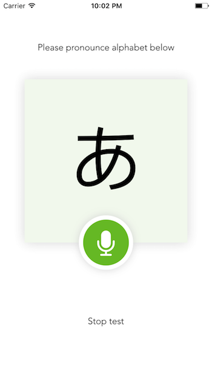
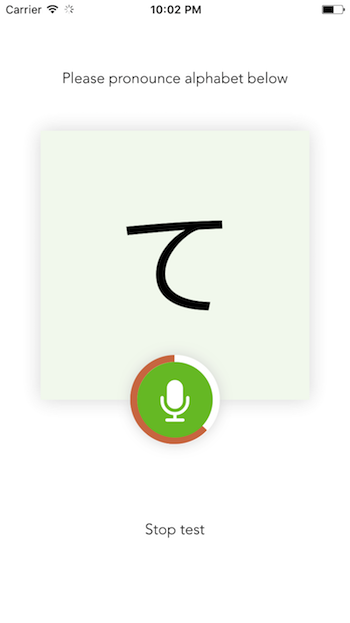

# PocketJalpha is a mobile APP aiming to assist Japanese learning

### Environment dependencies
`node`, `webpack`, `cordova`, `xcode`

### Install dependencies
run `npm install`

### To run the project on local server
Simply run `npm run start`

### To build the project
Simply run `npm run build`

### Previews

